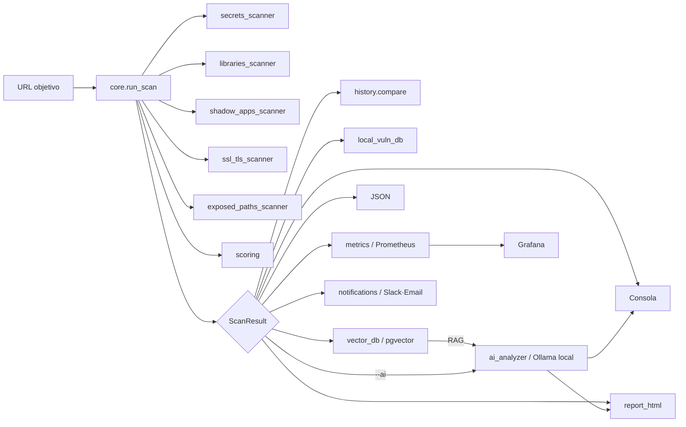

# 🛡️ ShopiScan

[](https://github.com/juanleongalan/shopiscan/actions/workflows/ci.yml)
[](LICENSE)
[](https://www.python.org/)

**Auditor de seguridad pasivo para tiendas Shopify, potenciado por Inteligencia Artificial 100% LOCAL (Ollama).**

ShopiScan analiza una tienda Shopify desde fuera —igual que lo haría
cualquier visitante— y usa un modelo de lenguaje ejecutado **localmente
con Ollama** (sin API keys, sin cuotas, sin enviar datos a terceros) para
correlacionar los hallazgos técnicos en un **Informe Ejecutivo de
Riesgo**: severidad, impacto de negocio, explicación técnica y remediación
exacta (Liquid, JS, cabeceras HTTP, configuración del Admin de Shopify).

Incluye además un stack opcional de datos y observabilidad: **PostgreSQL +
pgvector** para búsqueda semántica de hallazgos similares entre escaneos,
y **Prometheus + Grafana** para métricas y dashboards.

> Ciberseguridad / Desarrollo de Software.
> Código abierto bajo licencia MIT.

---

## ⚠️ Aviso legal y ético

Esta herramienta es **exclusivamente para fines educativos y auditorías
autorizadas**. El usuario es responsable de obtener permiso explícito antes
de escanear cualquier sitio web que no le pertenezca. Los autores no se
hacen responsables del mal uso de este software.

Escanear sistemas sin autorización puede constituir un **delito** según la
legislación de tu país (p. ej. Ley de Delitos Informáticos, Computer Fraud
and Abuse Act, etc.). ShopiScan **no realiza fuerza bruta, explotación
ni acceso no autorizado**: solo analiza información pública (HTML, headers
HTTP, archivos como `robots.txt`). El CLI exige una confirmación explícita
de autorización antes de cada escaneo.

---

## 1. Introducción y justificación

Shopify es una plataforma SaaS cerrada: no existe acceso al servidor ni al
núcleo, por lo que herramientas clásicas de auditoría (equivalentes a
WPScan para WordPress o JoomScan para Joomla) no tienen un homólogo directo
en este ecosistema. ShopiScan nace para cubrir ese vacío, centrándose
en lo que sí es auditable de forma pasiva desde fuera de la plataforma:
tema activo, apps de terceros, cabeceras de seguridad, cookies, exposición
de catálogo/inventario y credenciales filtradas accidentalmente en el
frontend.

El valor añadido frente a un escáner de reglas estáticas es la capa de
razonamiento con IA: en lugar de listar "falta el header CSP", el sistema
correlaciona todos los hallazgos y genera un informe apto tanto para un
perfil técnico (desarrollador/DevOps) como para la dirección de la tienda
(impacto de negocio, sin jerga).

| | Escáneres tradicionales | ShopiScan |
|---|---|---|
| Motor de análisis | Reglas estáticas, se desactualizan | Reglas + IA dinámica y contextual |
| Salida | "Falta el header CSP" | Explica el impacto de negocio **y** da el código de solución |
| Público objetivo | Perfil técnico | Perfil técnico + dirección de la tienda |
| Alcance | A veces agresivo/fuerza bruta | 100% pasivo, sin ataques activos |

### ¿Qué se puede escanear?

ShopiScan funciona sobre **cualquier sitio web que tenga Shopify
implementado**, no solo dominios `*.myshopify.com`. La detección
(`detect_shopify()`) se basa en huellas técnicas (headers `X-ShopId`,
referencias a `cdn.shopify.com`, la variable global `Shopify.shop`), así
que funciona igual de bien sobre:

- El dominio por defecto de desarrollo: `mi-tienda.myshopify.com`
- Un dominio propio con Shopify por detrás: `www.mi-marca.com`,
  `tienda.mi-marca.es`, etc. (el caso más habitual en producción)
- Cualquier URL concreta dentro de la tienda (una página de producto, de
  política de envíos, de checkout de contraseña...) — ShopiScan analiza
  la respuesta de esa URL y, si detecta Shopify, escanea la tienda a
  partir de ahí.

En la práctica: si puedes visitar la tienda con un navegador normal,
puedes apuntar ShopiScan a esa URL.

---

## 2. Funcionalidades

**Reconocimiento y huellas digitales**
- Detección de tiendas Shopify (headers, CDN, variables JS)
- Identificación del tema activo (nombre real, rol e ID vía `Shopify.theme`)
- Huellas de ~30 apps/servicios conocidos (Klaviyo, Judge.me, Loox,
  ReCharge, Gorgias, Google Analytics, Meta Pixel, TikTok Pixel, etc.)

**Seguridad**
- Detección de credenciales filtradas: tokens de Admin API de Shopify,
  claves de AWS, Stripe, Google, Slack, Mailchimp, bloques de clave privada
- Librerías JS desactualizadas con CVEs conocidas (jQuery, jQuery UI,
  Bootstrap, Lodash, Moment.js, AngularJS/EOL)
- **Detección de "shadow apps"**: residuos de código (contenedores,
  clases CSS, variables JS) que dejan atrás apps ya desinstaladas (20+ apps)
- **Chequeo de certificado y protocolo TLS**: certificado expirado o
  próximo a expirar, versión de TLS obsoleta (TLSv1/1.1)
- **Detección de rutas sensibles de infraestructura** (`/.env`,
  `/.git/config`, `/.git/HEAD`) con protección anti-falsos-positivos
  ("soft 404")
- Auditoría de cabeceras HTTP de seguridad (HSTS, CSP, X-Frame-Options...)
- Auditoría de cookies sin flag `Secure`
- Detección de tienda protegida con contraseña

**Exposición de datos**
- Endpoints públicos de la Storefront API (`products.json`,
  `collections.json`, `cart.js`) — clasificado como **Baja** severidad
  (impacto real de negocio: scraping de catálogo/precios por competidores)
- Detección de stock (`inventory_quantity`) público en el catálogo
- Meta tag `generator` (fuga de información de plataforma)

> **Nota sobre la política de severidad:** tras analizar más de 30
> escaneos reales, se revisaron dos criterios para reflejar mejor el
> riesgo práctico: (1) "Cookies sin flag Secure" ahora es **Media** solo
> si el sitio tampoco envía `Strict-Transport-Security` (sin HSTS, un
> ataque de degradación SSL es más plausible); con HSTS activo baja a
> **Baja**. (2) Las credenciales realmente filtradas (Google API key,
> Mailchimp) subieron de Media a **Alta**: una fuga de credencial real
> es más grave que una cabecera ausente, aunque la clave esté restringida
> por dominio.

**Inteligencia y reporting**
- Score de riesgo global 0-100, transparente (suma de pesos por
  severidad) con etiqueta Bajo/Medio/Alto/Crítico
- **Clasificación OWASP Top 10 (2021)**: cada hallazgo se etiqueta con su
  categoría (A01 Control de Acceso, A02 Fallos Criptográficos, A05
  Configuración Incorrecta, A06 Componentes Desactualizados, A07
  Autenticación...) — 100% basada en reglas, así que funciona igual con o
  sin `--ai`. Da contexto de "qué TIPO de problema es" más allá de la
  severidad, útil cuando la mayoría de hallazgos son de severidad Baja
- **Sugerencias de remediación por hallazgo**, basadas en reglas (funcionan
  igual con o sin `--ai`) — visibles en consola, HTML y Grafana
- **Informe Ejecutivo de Riesgo con IA local (Ollama)**: resumen de
  negocio, hallazgos correlacionados, remediación paso a paso y snippets
  de código exactos — sin API keys ni envío de datos a terceros
- **Búsqueda vectorial (PostgreSQL + pgvector)**: recupera hallazgos
  históricos semánticamente similares de otros escaneos y se los pasa al
  LLM como contexto (RAG-lite)
- **Base de datos local incremental** (SQLite): patrones de temas/scripts
  recurrentes que crecen con cada escaneo
- **Comparación histórica**: cada escaneo se compara automáticamente
  contra el anterior de la misma tienda (score, hallazgos nuevos/resueltos)
- **Observabilidad (Prometheus + Grafana)**: métricas por tienda (score,
  hallazgos por severidad, por categoría OWASP, duración) y dashboards
  provisionados con descripción y solución de cada hallazgo
- **Interfaz web propia** (`shopiscan-server`, `GET /`): formulario para
  escanear sin usar la terminal, con checkboxes para elegir qué escanear
  (IA, histórico, base de datos vectorial, descarga de scripts...)
- **Servidor HTTP opcional (FastAPI)** con endpoint `/metrics` nativo
- **Colores de severidad estandarizados** en consola, HTML y Grafana:
  Crítica=rojo, Alta=naranja, Media=amarillo, Baja=verde, Info=azul
- Informe HTML con diseño propio, listo para presentar o exportar a PDF
- **Informes organizados en carpetas por escaneo**
  (`shopiscan_reports/<tienda>/<fecha_hora>/`), no acumulados sueltos
- Escaneo en batch (`--url-file`) y exportación a JSON
- **Integración CI/CD**: workflows de GitHub Actions listos para tests
  automáticos y escaneo periódico programado (ver sección 7)
- Suite de pruebas automatizadas con `pytest` (141 tests)

---

## 3. Arquitectura del software

Ver [`docs/ARCHITECTURE.md`](docs/ARCHITECTURE.md) para los diagramas
completos (componentes y flujo de datos en Mermaid). Resumen:



Estructura de carpetas:

```
ShopiScan/
├── .github/
│   └── workflows/
│       ├── ci.yml               # Tests automáticos en cada push/PR
│       └── scheduled-scan.yml   # Escaneo periódico programado (cron)
├── src/
│   └── shopiscan/
│       ├── __init__.py          # CLI, orquestación, modo batch
│       ├── core.py              # Motor de escaneo (detección, tema, apps, headers, catálogo)
│       ├── secrets_scanner.py   # Detección de credenciales/tokens filtrados
│       ├── libraries_scanner.py # Librerías JS desactualizadas con CVEs
│       ├── shadow_apps_scanner.py # Residuos de apps desinstaladas (20+ apps)
│       ├── ssl_tls_scanner.py   # Certificado y versión de TLS
│       ├── exposed_paths_scanner.py # Rutas sensibles (.env, .git) con anti-soft-404
│       ├── history.py           # Comparación entre escaneos de la misma tienda
│       ├── local_vuln_db.py     # Base de datos local incremental (SQLite)
│       ├── vector_db.py         # Búsqueda semántica (PostgreSQL + pgvector)
│       ├── notifications.py     # Alertas Slack/email cuando el riesgo empeora
│       ├── metrics.py           # Métricas Prometheus (textfile collector, CLI)
│       ├── metrics_prom.py      # Métricas Prometheus (prometheus_client, servidor)
│       ├── scoring.py           # Cálculo del score de riesgo 0-100
│       ├── ai_analyzer.py       # Informe Ejecutivo de Riesgo con Ollama (local)
│       ├── server.py            # Servidor HTTP opcional (FastAPI + /metrics)
│       └── report_html.py       # Generador de informe HTML
├── deploy/                      # Stack Docker (opcional)
│   ├── docker-compose.yml       # Postgres+pgvector, Ollama, Prometheus, Grafana, app
│   ├── Dockerfile               # Imagen del servidor ShopiScan
│   ├── db/init.sql              # Esquema PostgreSQL + pgvector
│   ├── prometheus/prometheus.yml
│   └── grafana/                 # Datasources y dashboard provisionados
├── tests/                       # 100 tests (pytest, sin red real)
├── docs/
│   └── ARCHITECTURE.md          # Diagramas de arquitectura (Mermaid)
├── conftest.py                  # Permite ejecutar pytest sin instalar el paquete
├── stores.example.txt           # Plantilla para el escaneo programado en CI
├── requirements.txt
├── setup.py                     # Extras: ai, vector, server, full, dev
├── .env.example
├── .gitignore
├── LICENSE                      # MIT
└── README.md
```

---

## 4. Manual de instalación

Requiere **Python 3.9+**.

```bash
# 1. Clonar el repositorio
git clone https://github.com/juanleongalan/shopiscan.git
cd shopiscan

# 2. Crear un entorno virtual (recomendado)
python3 -m venv venv
source venv/bin/activate        # Windows: venv\Scripts\activate

# 3. Instalar. Elige según lo que necesites:
pip install -e .                # solo el escáner técnico (sin IA)
pip install -e ".[ai]"          # + IA local con Ollama (--ai)
pip install -e ".[vector]"      # + búsqueda vectorial (PostgreSQL/pgvector)
pip install -e ".[server]"      # + servidor HTTP (FastAPI + /metrics)
pip install -e ".[full]"        # todo lo anterior junto
pip install -e ".[dev]"         # + pytest para ejecutar los tests
```

El núcleo del escáner solo necesita `requests`, `beautifulsoup4` y
`colorama`. La IA (Ollama), la base de datos vectorial (PostgreSQL) y el
servidor son extras opcionales que se instalan solo si los vas a usar.

Esto registra el comando `shopiscan` (y `shopiscan-server` si instalaste
el extra `server`), disponible desde cualquier carpeta mientras el
entorno virtual esté activo.

> Para la IA necesitas además Ollama en marcha con los modelos
> descargados — ver sección 5.

---

## 5. Configuración de la IA local con Ollama

ShopiScan usa **Ollama** para ejecutar el modelo de lenguaje **en tu
propia máquina**: sin API keys, sin cuotas, sin límites de peticiones y
sin enviar los datos del escaneo a ningún servicio externo. Esto es más
privado (los datos de tiendas de terceros nunca salen de tu equipo) y más
barato (gratis) que cualquier API en la nube.

1. Instala Ollama desde <https://ollama.com> (Ollama Desktop en
   Windows/Mac, o el paquete de tu distro en Linux).
2. Descarga los modelos que usa ShopiScan (una sola vez):

   ```bash
   ollama pull llama3.1          # modelo de chat para el informe
   ollama pull nomic-embed-text  # modelo de embeddings para pgvector
   ```

3. Asegúrate de que Ollama esté en marcha (Ollama Desktop lo deja
   corriendo en segundo plano; en Linux/servidor: `ollama serve`).
4. Instala ShopiScan con el extra de IA y lanza un escaneo con `--ai`:

   ```bash
   pip install ".[ai]"
   shopiscan -u https://tienda.com --ai
   ```

Por defecto ShopiScan habla con Ollama en `http://127.0.0.1:11434`. Si
Ollama corre en otra máquina o contenedor, configúralo en `.env`:

```
OLLAMA_URL=http://127.0.0.1:11434
OLLAMA_CHAT_MODEL=llama3.1
OLLAMA_EMBED_MODEL=nomic-embed-text
# OLLAMA_FALLBACK_MODEL=llama3.2   # modelo de reserva si el principal no está
```

Si Ollama no está disponible, ShopiScan sigue funcionando en modo "solo
escaneo técnico": la IA es un módulo opcional, no una dependencia dura.

> **Nota:** cada línea de tu `.env` debe empezar por `#` (comentario) o
> tener la forma `CLAVE=valor`. Si alguna línea no cumple eso (por
> ejemplo, un `#` que se perdió al editar el archivo), ShopiScan te
> avisa con un único mensaje claro al arrancar — el resto de variables se
> cargan con normalidad, no es un error grave, pero conviene revisar esa
> línea si esperabas que se aplicara.

### 🔧 Solución de problemas de Ollama

- **"No se pudo conectar con Ollama"** → Ollama no está en marcha. Abre
  Ollama Desktop, o ejecuta `ollama serve`. Si corre en otra máquina,
  ajusta `OLLAMA_URL`.
- **"Failed to connect to Ollama. Please check that Ollama is downloaded,
  running and accessible."** (con Ollama SÍ corriendo — confirmado con
  `ss -tulpn | grep 11434` u `ollama list`) → normalmente es un
  **timeout**, no una desconexión real: la primera petición a un modelo
  grande (varios GB) tarda en cargarlo en memoria, sobre todo sin GPU
  dedicada, y la librería `ollama` usa por defecto un timeout muy corto
  (~5s) que no da tiempo a eso. ShopiScan ya usa un timeout de 180s por
  este motivo; si aun así no es suficiente en tu máquina, súbelo con
  `OLLAMA_TIMEOUT_SECONDS=600` en tu `.env`. Este error concreto sale
  tanto para un fallo de conexión real como para un timeout, así que si
  Ollama está confirmado en marcha, es casi siempre esto.
- **"El modelo 'llama3.1' no está descargado"** → no pasa nada: ShopiScan
  detecta automáticamente qué otros modelos tienes instalados (`ollama
  list`) y prueba con el primero disponible, sin que tengas que hacer
  nada. Si prefieres el modelo exacto, descárgalo con
  `ollama pull llama3.1` o indica uno instalado con `--model`.
- **Va lento** → los modelos locales dependen de tu CPU/GPU. Prueba un
  modelo más ligero (`OLLAMA_CHAT_MODEL=llama3.2` o `phi3`), o deja el
  escaneo técnico sin `--ai` y usa la IA solo cuando la necesites.
- **"Escaneo desde `shopiscan-server` en local, pero no aparece en el
  Grafana del docker-compose ni guarda histórico al re-escanear"** →
  estás usando **dos instancias independientes**: `shopiscan-server`
  ejecutado a mano usa tu Ollama/`.env` locales (y, si `DATABASE_URL` no
  apunta explícitamente al Postgres del stack, ninguna base de datos), y
  el `shopiscan_app` del `docker-compose` usa su propio Ollama/Postgres
  dentro de la red de Docker — no comparten datos entre sí aunque los
  ejecutes en la misma máquina. Si quieres todo integrado (Grafana con
  datos, histórico persistente, búsqueda vectorial), usa **solo**
  `./up.sh` (o `docker compose up -d --build`) y entra a <http://localhost:8000>; no lances
  también `shopiscan-server` por tu cuenta. Al arrancar,
  `shopiscan-server` ahora imprime qué `OLLAMA_URL`/`DATABASE_URL` está
  usando realmente, y avisa explícitamente si detecta que no corre
  dentro de un contenedor — revisa ese aviso si tienes dudas de qué
  instancia estás usando.

### 🔧 "Marca 'Guardar informe en disco' pero no encuentro el archivo"

Bug ya corregido. `shopiscan_reports` estaba declarado en
`docker-compose.yml` como un **volumen nombrado de Docker** — Docker lo
gestiona internamente (en algo como
`/var/lib/docker/volumes/deploy_shopiscan_reports/_data/`), no es una
carpeta normal de tu disco, así que nunca lo ibas a encontrar navegando
tu sistema de archivos aunque el mensaje "Informe guardado también en:
..." apareciera correctamente (el archivo sí se escribía, solo que
dentro del volumen). Ahora es un **bind mount** a `deploy/shopiscan_reports/`
— una carpeta real, creada automáticamente la primera vez que escaneas
con "Guardar informe en disco" activado. Si venías de una versión
anterior, `docker compose down && ./up.sh` para que Docker recree el
mount correctamente.

### 🔧 "Me marca /.env o /.git como expuesto y no debería"

Si un hallazgo `[CRÍTICA] Archivo .env accesible públicamente` te parece
un falso positivo: desde la versión actual, ShopiScan valida que el
contenido devuelto **tenga la forma real** de un `.env` (líneas
`CLAVE=valor` o palabras como `SECRET`/`PASSWORD`/`API_KEY`) antes de
reportarlo — una página HTML normal (con `<html>`, `<!DOCTYPE>`, etc.)
nunca se marca, aunque el servidor responda 200. Si sigues viendo un
falso positivo con esta validación activa, probablemente el servidor
esté devolviendo contenido con pinta de `.env` real para esa ruta
concreta (algo que vale la pena revisar manualmente); en cualquier caso,
puedes comprobarlo tú mismo con `curl -i https://tu-tienda.com/.env`.

### Stack completo con Docker (Ollama + PostgreSQL/pgvector + Prometheus + Grafana)

Si quieres la experiencia completa (interfaz web + búsqueda vectorial +
dashboards) sin instalar nada a mano, usa el `docker-compose` incluido
en `deploy/`:

```bash
cd deploy
./up.sh
```

`up.sh` para los contenedores previos, **reconstruye siempre la imagen
de ShopiScan sin caché** y vuelve a levantar el stack — así te aseguras
de estar corriendo el código actual y evitas el problema más habitual
al actualizar ShopiScan (ver el aviso de abajo). Si prefieres los
comandos manuales:

```bash
cd deploy
docker compose down
docker compose up -d --build
```

Esto levanta **todo integrado en un único comando**: PostgreSQL con
pgvector, Ollama (y descarga los modelos automáticamente la primera
vez), el servidor HTTP de ShopiScan (interfaz web + API + endpoint
`/metrics`), un Pushgateway, Prometheus y Grafana — ya conectados entre
sí en la misma red de Docker.

> **⚠️ "Visito http://localhost:8000 y veo `{"detail":"Not Found"}`"** —
> es el síntoma más común al actualizar ShopiScan: `docker compose up -d`
> **sin** `--build` reutiliza la imagen ya construida anteriormente,
> aunque el código haya cambiado (comportamiento estándar de Docker, no
> un fallo). Usa `./up.sh`, o manualmente
> `docker compose down && docker compose up -d --build`. Verifica qué
> versión corre realmente con `curl http://localhost:8000/health` — el
> campo `build_time_utc` te dice cuándo se compiló esa imagen de verdad.

> **Importante:** la interfaz web **ya está integrada** en el contenedor
> `shopiscan_app` — no hace falta ejecutar `shopiscan-server` por
> separado en tu máquina. Simplemente abre **<http://localhost:8000>**
> tras levantar el stack. Si además ejecutas `shopiscan-server`
> en local, tendrías dos servidores independientes con datos distintos
> (uno usando tu Ollama/Postgres local, otro los del contenedor) — usa
> solo uno de los dos caminos a la vez.
>
> El histórico y la base de datos local (`~/.shopiscan/`) se guardan en
> el volumen `shopiscan_home` (gestionado por Docker), y los informes
> guardados desde la interfaz web se guardan en **`deploy/shopiscan_reports/`**
> — una carpeta real en tu disco (bind mount, no un volumen nombrado de
> Docker), así que puedes navegarla directamente sin `docker exec`/`docker cp`.
> Ambos sobreviven a un `docker compose down && up`, no solo a un simple
> restart.

- **Interfaz web de ShopiScan**: <http://localhost:8000> — un formulario
  con tema oscuro para pegar la URL objetivo. Justo debajo tienes, en
  este orden y centrados: el botón **"Escanear"** (lanza con los valores
  por defecto), la confirmación de autorización, la leyenda de colores
  de severidad, y un aviso de que puedes ajustar parámetros más abajo.

  Los parámetros del escaneo están agrupados en **menús desplegables**
  (uno por sección, colapsados por defecto — pulsa el título para
  desplegarlos):

  | Sección | Opciones |
  |---|---|
  | Alcance del escaneo | Descargar scripts externos (busca credenciales); comparar con el histórico; base de datos local incremental; búsqueda vectorial (pgvector) |
  | Inteligencia artificial | Activar Informe Ejecutivo con IA; modelo de Ollama a usar (opcional, si no se indica usa el configurado por defecto) |
  | Observabilidad | Registrar en Prometheus (visible en Grafana) |
  | Guardado | Guardar el informe en disco (`deploy/shopiscan_reports/<tienda>/<fecha_hora>/` con Docker; `./shopiscan_reports/...` si usas `shopiscan-server` en local), además de mostrarlo en la propia página |
  | Ajustes avanzados | Notificar si el riesgo empeora, con umbral configurable (requiere Slack/email en el servidor) |

  Un segundo botón "Escanear" (con el mismo estilo que el de arriba, y
  también centrado) cierra el formulario tras ajustar cualquier opción.

  La casilla de autorización **nunca viene marcada por defecto** (y el
  formulario se resetea si recargas la página), precisamente para que
  sea una confirmación real, no un trámite que el navegador rellene solo.

  Al pulsar "Escanear", el navegador te **redirige a una página de
  resultados independiente** (`/scan/result/<id>`) con el mismo tema
  oscuro que el formulario (severidad, categorías OWASP, soluciones
  sugeridas), organizada en tarjetas en cuadrícula que aprovechan el
  ancho de la pantalla (score, tema/plataforma y servicios en una fila;
  hallazgos como tarjetas lado a lado, no una lista apilada) — ya no se
  muestra incrustado en la misma página del formulario. Esa página de
  resultados tiene su propia barra superior: pulsa el icono o
  "ShopiScan" para volver al formulario y lanzar otro escaneo. Si el
  objetivo no resulta ser una tienda Shopify, verás
  "No se ha detectado tienda Shopify." en una página con el mismo estilo.

  > Los resultados se guardan en memoria en el proceso del servidor
  > (para que la redirección funcione) y son efímeros: si reinicias el
  > servidor, el enlace deja de funcionar. Para conservar un informe de
  > verdad, activa "Guardar informe en disco".
- Grafana: <http://localhost:3000> (usuario `admin`, contraseña `admin`) —
  con el dashboard de ShopiScan y los datasources (Prometheus + Postgres)
  ya provisionados. Los escaneos hechos desde la interfaz web usan
  exactamente las mismas métricas (mismo nombre y etiquetas) que los
  hechos por la CLI, así que aparecen en el mismo dashboard sin
  configuración adicional.
- Prometheus: <http://localhost:9090>
- API JSON de ShopiScan: <http://localhost:8000/health>

También puedes usar la API JSON directamente (para integraciones/scripts):

```bash
curl -X POST http://localhost:8000/scan \
  -H "Content-Type: application/json" \
  -d '{"url": "https://tu-tienda-autorizada.com", "authorized": true, "ai": true}'
```

Sin Docker, puedes lanzar solo el servidor (interfaz web incluida) con:

```bash
pip install -e ".[server]"
shopiscan-server
# Abre http://localhost:8000
```

### 🔧 "shopiscan-server dice que falta uvicorn / no arranca la interfaz web"

El error `[-] uvicorn no está instalado` significa exactamente eso: el
extra `server` no se instaló. La causa más habitual es un error de
sintaxis muy fácil de cometer:

```bash
# ❌ MAL — el espacio hace que pip busque un paquete llamado "server" en
# PyPI (que no existe) en vez de instalar el extra de ShopiScan:
pip install -e . server

# ✅ BIEN — "server" va PEGADO al punto, entre corchetes, sin espacio:
pip install -e ".[server]"
```

Las comillas dobles son obligatorias en shells como **zsh** (el shell por
defecto en Kali/Parrot OS): sin ellas, zsh intenta interpretar `[server]`
como un patrón de fichero y falla con `no matches found`.

Tras instalarlo correctamente deberías ver `fastapi`, `uvicorn`,
`prometheus-client` y `python-multipart` en la salida de `pip install`.
Compruébalo con:

```bash
pip show uvicorn fastapi
```

> **"Visito http://localhost:8000/ y me sale `{"detail":"Not Found"}`"**
> — eso es un 404 estándar de FastAPI: el servidor SÍ está arrancado,
> pero la ruta `/` de ese proceso concreto no existe. Casi siempre es
> porque estás accediendo a una versión **antigua** del servidor (por
> ejemplo, la imagen de Docker se construyó antes de que existiera la
> interfaz web). Si usas el `docker-compose` de `deploy/`, reconstruye la
> imagen tras cualquier actualización del código:
> ```bash
> cd deploy
> docker compose up -d --build
> ```
> Si lo ejecutas en local (`shopiscan-server` directo, sin Docker), una
> instalación editable (`pip install -e ...`) ya recoge los cambios de
> código sin reinstalar — pero asegúrate de estar arrancando el proceso
> desde la carpeta correcta del proyecto actualizado, y no un proceso
> `shopiscan-server` antiguo que quedó corriendo en otra terminal.

---

## 6. Uso


### Escaneo básico (sin IA)

```bash
shopiscan -u https://tienda-ejemplo.com
```

### Escaneo con Informe Ejecutivo de Riesgo (IA)

```bash
shopiscan -u https://tienda-ejemplo.com --ai
```

### Todas las opciones

```bash
shopiscan --help
```

| Flag | Descripción |
|---|---|
| `-u, --url` | URL de la tienda objetivo (cualquier web con Shopify, no solo `*.myshopify.com`) |
| `--url-file` | Archivo con una URL por línea, para escaneo en batch |
| `--ai` | Activa el Informe Ejecutivo de Riesgo con IA local (Ollama) |
| `--model` | Modelo de chat de Ollama (por defecto: `llama3.1`, o `$OLLAMA_CHAT_MODEL`) |
| `--json` | Exporta el informe a un archivo JSON (`<dominio>_report.json`) |
| `--output` | Ruta exacta del archivo JSON de salida (ignora `--output-dir` si se indica) |
| `--output-dir` | Carpeta base para los informes, organizados en `<tienda>/<fecha_hora>/` (por defecto: `./shopiscan_reports`) |
| `--html-report` | Genera un informe HTML con diseño para presentar |
| `--no-fetch-scripts` | Desactiva la descarga de scripts externos al buscar credenciales filtradas |
| `--no-history` | No guarda ni compara con el histórico de escaneos anteriores de esta tienda |
| `--no-local-db` | No registra este escaneo en la base de datos local incremental |
| `--no-vector-db` | No usa PostgreSQL+pgvector aunque `DATABASE_URL` esté configurado |
| `--no-metrics` | No escribe métricas de Prometheus tras el escaneo |
| `--metrics-dir` | Directorio para las métricas `.prom` (o `$PROMETHEUS_TEXTFILE_DIR`) |
| `--vuln-db-stats` | Muestra un resumen de la base de datos local y termina (no requiere `-u`) |
| `--no-notify` | No envía notificaciones (Slack/email) aunque el score haya empeorado |
| `--notify-threshold` | Puntos de empeoramiento a partir de los cuales notificar (por defecto: 0) |
| `-y, --yes` | Confirma autorización sin prompt interactivo (útil en CI) |
| `--no-banner` | Oculta el banner ASCII |

> **Ctrl+C:** interrumpir un escaneo con Ctrl+C ya no lo aborta sin más —
> pregunta `¿Deseas continuar el escaneo? [s/N]`. Si respondes que sí,
> reanuda desde la misma tienda; si no, termina limpiamente.

### Ejemplos adicionales

```bash
# Informe HTML con diseño, listo para tu presentación de defensa
shopiscan -u https://tienda.com --html-report -y

# Varias tiendas en batch, con IA y exportando cada una a JSON
shopiscan --url-file mis-tiendas.txt --ai --json -y

# Escaneo rápido sin descargar scripts externos (menos peticiones)
shopiscan -u https://tienda.com --no-fetch-scripts -y
```

Para convertir el informe HTML a PDF: ábrelo en tu navegador y usa
**Archivo → Imprimir → Guardar como PDF**.

---

## 7. OWASP, carpetas de informes, comparación histórica, shadow apps, base de datos local, notificaciones y CI/CD

### Clasificación OWASP Top 10 (2021)

Cada hallazgo se etiqueta automáticamente con su categoría del [OWASP Top
10 (2021)](https://owasp.org/Top10/) — visible en consola (`[A05:2021 -
...]` junto al título), en el HTML (badge morado + sección de
distribución al final del informe), en el JSON exportado (campo
`owasp_category` en cada finding, y `owasp_breakdown` en `risk`), y en
Prometheus/Grafana (métrica `shopiscan_owasp_findings_total`, panel
dedicado). Es una clasificación **100% basada en reglas** (módulo
`owasp_mapping.py`), así que funciona exactamente igual con o sin
`--ai`: no depende de que Ollama esté disponible.

Esto da contexto de "¿qué TIPO de problema es esto?" complementario a la
severidad ("¿cuánto importa?"). Por ejemplo, ver que 5 hallazgos "Baja"
son en realidad "A05: Configuración de Seguridad Incorrecta" repetida es
más accionable que una lista plana de "Baja, Baja, Baja...".

| Categoría | Hallazgos típicos de ShopiScan |
|---|---|
| A01 - Pérdida de Control de Acceso | Endpoints públicos de la Storefront API, `.env`/`.git` expuestos, stock público |
| A02 - Fallos Criptográficos | Cookies sin `Secure`, certificado/versión TLS |
| A05 - Configuración de Seguridad Incorrecta | Headers de seguridad ausentes, shadow apps, meta `generator` |
| A06 - Componentes Vulnerables y Desactualizados | Librerías JS desactualizadas (jQuery, etc.) |
| A07 - Fallos de Identificación y Autenticación | Credenciales/tokens filtrados |

### Informes organizados en carpetas por escaneo

Con `--json` y/o `--html-report`, ShopiScan ya no acumula archivos
sueltos en el directorio desde el que lo ejecutas. Cada escaneo se
guarda en su propia carpeta:

```
shopiscan_reports/
└── tu-tienda.com/
    ├── 20260722_140000/
    │   ├── report.json
    │   └── report.html
    └── 20260722_183000/
        ├── report.json
        └── report.html
```

```bash
# Cambiar la carpeta base (por defecto: ./shopiscan_reports)
shopiscan -u https://tienda.com --json --html-report --output-dir ./mis_informes

# --output sigue funcionando como override total para el JSON
# (ruta exacta, ignora --output-dir)
shopiscan -u https://tienda.com --json --output informe_especifico.json
```

### Comparación histórica entre escaneos

Cada vez que escaneas una tienda, ShopiScan guarda una instantánea
(score, etiqueta, títulos de hallazgos) en `~/.shopiscan/history/`
(fuera del repositorio, para no mezclar datos de escaneos con el
código). En el siguiente escaneo de la misma tienda, verás
automáticamente una sección "Comparación con el escaneo anterior" con la
evolución del score y qué hallazgos son nuevos o se resolvieron. Usa
`--no-history` para desactivar este comportamiento (por ejemplo, en
ejecuciones puntuales que no quieres que cuenten para el histórico).

### Detección de shadow apps

ShopiScan busca residuos de código (contenedores HTML, clases CSS,
variables JS) de apps conocidas del ecosistema Shopify que ya no cargan
ningún script activo — señal de que la app se desinstaló pero dejó
código muerto en el tema. El catálogo cubre más de 20 apps (Loox,
Judge.me, Yotpo, Klaviyo, ReCharge, Gorgias, Smile.io, PageFly/GemPages,
Stamped.io, Trustpilot, Rebuy, Zoorix, Appstle, Doofinder, Tidio, Hotjar,
Zendesk, Intercom, Crisp, Privy, Wheelio, Okendo, Attentive, Postscript,
AfterShip, Bold Apps...). Es una heurística, no una certeza: puede haber
falsos positivos si una app carga su script de forma diferida.

> **Corregido:** los marcadores de Zendesk y Hotjar usaban patrones
> demasiado genéricos (`zE(`, `hj(` — llamadas de función de solo 2
> caracteres) que coincidían por pura casualidad con identificadores
> internos de bundles JS minificados (webpack/rollup), generando un
> falso positivo de "Zendesk" en la mayoría de tiendas grandes con JS
> pesado, sin relación real con esa app. Ahora se exige la llamada real
> de la API (`zE('webWidget', ...)`, `hj('trigger', ...)`).

### Base de datos local incremental de vulnerabilidades/patrones

No existe un WPVulnDB equivalente público para Shopify (no hay un
catálogo centralizado de "tema X versión Y tiene la vulnerabilidad Z");
es una limitación real del ecosistema, no de esta herramienta. En vez de
inventar datos, ShopiScan construye su **propia base de datos local**
(SQLite, en `~/.shopiscan/local_vuln_db.sqlite3`) a partir de los
patrones que va observando en tus propios escaneos:

- Qué **temas** aparecen con más frecuencia y su score medio de riesgo.
- Qué **scripts sin identificar** se repiten en 3+ tiendas distintas
  (candidatos a añadirse al catálogo de `APP_FINGERPRINTS`).
- Qué **hallazgos** son más frecuentes en general.

Cuantas más tiendas escanees, más útil se vuelve: es incremental, crece
con el uso en vez de quedarse obsoleta como una lista estática. Cuando el
tema de la tienda actual tiene ≥2 observaciones previas con un score
medio ≥40/100, ShopiScan añade automáticamente un hallazgo informativo
("historial local de riesgo elevado") al informe — dejando siempre claro
que es una señal estadística local, no una vulnerabilidad confirmada.

```bash
# Ver el estado actual de la base de datos local (no requiere -u/--url-file)
shopiscan --vuln-db-stats

# Desactivar el registro/consulta de la base de datos local para un escaneo puntual
shopiscan -u https://tienda.com --no-local-db
```

### Notificaciones (Slack / email) cuando el riesgo empeora

Si configuras `SLACK_WEBHOOK_URL` y/o (`NOTIFY_EMAIL_TO` + `SMTP_HOST` +
`SMTP_PORT` + `SMTP_USER` + `SMTP_PASS`) — ver `.env.example` — ShopiScan
envía automáticamente una alerta cuando el score de riesgo **empeora**
respecto al escaneo anterior de la misma tienda (requiere que el
histórico esté activo, es decir, sin `--no-history`). Es opcional: si no
configuras nada, simplemente no se notifica.

```bash
# Solo notificar si el score empeora 10 puntos o más
shopiscan -u https://tienda.com --ai --notify-threshold 10

# Desactivar notificaciones para un escaneo puntual
shopiscan -u https://tienda.com --no-notify
```

### Interrupción con Ctrl+C

Si pulsas Ctrl+C durante un escaneo (o en medio de un batch), ShopiScan
no aborta sin más: pregunta explícitamente **"¿Deseas continuar el
escaneo? [s/N]"**. Si respondes que sí, reanuda desde la misma tienda que
estaba en curso; si respondes que no (o pulsas Ctrl+C de nuevo en el
propio prompt), termina limpiamente y, en modo batch, muestra el resumen
parcial de lo escaneado hasta ese momento.

### Búsqueda vectorial de hallazgos similares (PostgreSQL + pgvector)

Si defines `DATABASE_URL` (apuntando a un PostgreSQL con la extensión
`vector`, como el del `docker-compose`), ShopiScan genera un **embedding**
de cada hallazgo con Ollama (`nomic-embed-text`) y lo guarda en pgvector.
Ante cada escaneo, recupera los hallazgos históricos semánticamente más
parecidos (aunque el texto no sea idéntico) y se los pasa al LLM como
contexto adicional (RAG-lite), lo que mejora la calidad del Informe
Ejecutivo al reconocer patrones recurrentes entre tiendas. Si no hay
`DATABASE_URL` (o Ollama/pgvector no están disponibles), esta capa
simplemente se omite. Se desactiva por escaneo con `--no-vector-db`.

> **`operator does not exist: vector <=> double precision[]`** — bug ya
> corregido. La inserción de embeddings funcionaba (PostgreSQL aplica un
> cast implícito al insertar en una columna `vector`), pero la búsqueda
> por similitud con el operador `<=>` exige tipos exactos y necesitaba un
> cast explícito (`%s::vector`) en el parámetro, que ahora está añadido
> en ambas consultas. Si sigues viendo este error, asegúrate de estar
> usando la última versión de `vector_db.py`.

> **"Grafana muestra bien el score/severidad/OWASP (vía Prometheus) pero
> las tablas de PostgreSQL ('Últimos hallazgos', 'Hallazgos más
> frecuentes') están vacías"** — bug ya corregido. Ollama migró su API de
> embeddings de `/api/embeddings` (método antiguo `client.embeddings()`)
> a `/api/embed` (método actual `client.embed()`), con una forma de
> respuesta distinta. Si tu versión de la librería `ollama` no encajaba
> exactamente con el método antiguo que usábamos, la generación de
> embeddings fallaba en silencio: los hallazgos nunca llegaban a
> insertarse en pgvector, aunque el resto del escaneo (incluida la IA vía
> `chat()`, que usa un endpoint distinto) funcionara con normalidad. Ahora
> `get_embedding()` prueba primero la API actual y cae automáticamente a
> la antigua si hace falta. Además, si la indexación vectorial falla por
> **cualquier** motivo, la interfaz web ahora muestra el error real junto
> al informe (antes solo quedaba en los logs del contenedor).
>
> **Ojo con los logs si depuras esto a mano:** `journalctl -u ollama`
> muestra tu Ollama **local** del sistema, que es un proceso e incluso un
> volumen de modelos completamente distinto al Ollama que corre **dentro**
> del contenedor Docker. Los comandos correctos para depurar el stack de
> Docker son `docker logs shopiscan_app` (para ver el aviso real de
> ShopiScan) y `docker exec shopiscan_ollama ollama list` (para ver qué
> modelos tiene descargados de verdad ese contenedor — puede no coincidir
> con lo que muestra `ollama list` en tu máquina). Una causa muy habitual:
> el contenedor `ollama-init` descarga `llama3.1` (4.9GB, tarda) y
> `nomic-embed-text` (274MB) por separado; si el primero falla o tarda
> demasiado, el segundo —imprescindible para pgvector— podía quedarse sin
> descargar. Ya se pullan de forma independiente y con reintentos, para
> que un fallo en uno no bloquee al otro.

### Observabilidad con Prometheus y Grafana

Tras cada escaneo, ShopiScan puede exponer métricas por tienda (score de
riesgo, hallazgos por severidad, credenciales filtradas, duración...).
Hay **tres formas** de llevar esos datos a Grafana, según cómo escanees:

**A) Escaneas con la CLI (`shopiscan -u ...`), fuera de Docker — el caso
más común.** Usa el **Pushgateway** incluido en el `docker-compose`:

1. Levanta el stack: `cd deploy && ./up.sh`
2. En tu `.env` (en la carpeta desde la que ejecutas `shopiscan`, **no**
   dentro de `deploy/`):
   ```
   PROMETHEUS_PUSHGATEWAY_URL=http://localhost:9091
   ```
3. Escanea normalmente: `shopiscan -u https://tu-tienda.com --ai`. Verás
   en la salida `[+] Métricas enviadas al Pushgateway de Prometheus`.
4. Abre Grafana en <http://localhost:3000> (admin/admin) → dashboard
   "ShopiScan" → los datos aparecen en el siguiente scrape de Prometheus
   (cada 15s por defecto). También puedes ver los datos crudos en el
   propio Pushgateway: <http://localhost:9091>.

**B) Escaneas contra el servidor HTTP** (`shopiscan-server` o el
contenedor `shopiscan` del compose): Prometheus ya scrapea su endpoint
`/metrics` directamente, sin nada que configurar — solo asegúrate de
escanear vía `POST /scan` (ver sección 5) y no con la CLI.

**C) Prefieres `node_exporter`** (si ya lo tienes en tu infraestructura):
usa `--metrics-dir ./metrics` (o `PROMETHEUS_TEXTFILE_DIR`) para que
ShopiScan escriba archivos `.prom`, y apunta el
`--collector.textfile.directory` de tu `node_exporter` a esa carpeta.

> **"Levanté el docker-compose y Grafana no muestra nada"** — la causa
> más habitual es la **A**: si escaneas con la CLI desde tu terminal
> (fuera de Docker) sin configurar `PROMETHEUS_PUSHGATEWAY_URL`, las
> métricas no tienen forma de llegar al stack — el servidor `shopiscan`
> del compose y la CLI de tu terminal son procesos completamente
> distintos. Configura el Pushgateway (paso A) o escanea vía la API del
> servidor (paso B).

> **"El Pushgateway SÍ tiene mis métricas (las veo en
> `http://localhost:9091`) pero el dashboard de Grafana sigue en 'No
> data'"** — eran dos bugs de la plantilla del dashboard, ya corregidos:
> (1) los datasources de Grafana no tenían un `uid` fijo, así que el
> dashboard (que referencia `uid: prometheus` / `uid: postgres`) no los
> encontraba; (2) algunos paneles consultaban nombres de métrica del modo
> servidor (`shopiscan_last_risk_score`, `shopiscan_scans_total`...) que
> no son los que la CLI+Pushgateway realmente envía
> (`shopiscan_risk_score`, sin contador de escaneos ni histograma de
> duración por ese camino). Si ya tenías el stack levantado, haz
> `docker compose down && docker compose up -d --build` (o `./up.sh`) desde `deploy/` para que
> Grafana vuelva a provisionar el datasource y el dashboard actualizados.

> **"You don't currently have a default database configured for this
> data source"** (panel de PostgreSQL) — cambio de comportamiento de
> Grafana en versiones recientes: el campo `database` del datasource
> ahora debe ir dentro de `jsonData`, no en el nivel superior del YAML de
> provisioning. Ya corregido en `datasources.yml`. Igual que arriba,
> reinicia el stack (`./up.sh`) para
> que Grafana recargue la configuración del datasource.

El dashboard incluye un panel **"Hallazgos por categoría OWASP Top 10"**
(donut) además del de severidad, y dos tablas de PostgreSQL: los últimos
hallazgos indexados y los hallazgos más frecuentes de todo el histórico
— así puedes ver de un vistazo qué TIPO de problema predomina (p. ej.
"Configuración incorrecta" vs. "Componentes desactualizados"), no solo
cuántos hallazgos de severidad Baja hay.

### Modelos de Ollama: cambio automático si uno falla

Si el modelo de chat configurado no está descargado, ShopiScan ya no se
rinde sin más: primero prueba `OLLAMA_FALLBACK_MODEL` si lo has definido
en tu `.env`, y si tampoco existe, **consulta automáticamente qué modelos
tienes instalados en Ollama** (equivalente a `ollama list`) y prueba con
el primero que encuentre — sin que tengas que configurar nada a mano. El
JSON exportado incluye qué modelo generó finalmente el informe
(`_model_used`), así sabes cuál se usó realmente.

```bash
# Ver qué modelos tienes instalados
ollama list

# Si quieres forzar uno concreto en vez del auto-descubrimiento
shopiscan -u https://tienda.com --ai --model mistral
```

### Integración CI/CD con GitHub Actions

El repositorio incluye dos workflows listos para usar en
`.github/workflows/`:

- **`ci.yml`**: ejecuta la suite de `pytest` en cada `push`/`pull request`
  sobre Python 3.9, 3.11 y 3.12. No necesita ningún secret.
- **`scheduled-scan.yml`**: ejecuta ShopiScan automáticamente cada lunes
  (o manualmente desde la pestaña "Actions") contra las tiendas listadas
  en `stores.txt`, sube los informes JSON/HTML como artefactos
  descargables, y envía notificaciones si el riesgo de alguna tienda
  empeora. El histórico y la base de datos local se persisten entre
  ejecuciones con `actions/cache`.

Para activar el escaneo programado:

1. Copia `stores.example.txt` a `stores.txt` en la raíz del repo y añade
   las URLs de tiendas que estés autorizado a escanear (una por línea).
   `stores.txt` está en `.gitignore` porque puede contener objetivos
   privados.
2. (Opcional, para notificaciones) En GitHub ve a **Settings → Secrets
   and variables → Actions** y añade los secrets `SLACK_WEBHOOK_URL` y/o
   `SMTP_HOST`/`SMTP_PORT`/`SMTP_USER`/`SMTP_PASS`/`NOTIFY_EMAIL_TO`.
3. Lanza el workflow manualmente la primera vez desde la pestaña
   **Actions → Escaneo periódico programado → Run workflow** para
   comprobar que todo está bien configurado.

> **Nota sobre la IA en CI:** el Informe Ejecutivo con IA usa Ollama, que
> requiere un modelo local corriendo. En el runner por defecto de GitHub
> Actions no hay Ollama, así que el escaneo programado corre en **modo
> técnico** (que es igualmente completo: score, hallazgos, TLS, rutas
> expuestas, notificaciones...). Si quieres el informe de IA también en
> CI, usa un *self-hosted runner* con Ollama instalado y define
> `OLLAMA_URL` apuntando a él.

---

## 8. Caso de estudio (ejemplo real, riesgo bajo)

Salida real de un escaneo sin credenciales filtradas ni librerías
desactualizadas, con solo dos cabeceras de bajo impacto ausentes:

```
=== Resumen del escaneo ===
[*] Tema: shrinethemepro (ID: 153716326447, rol: main)
[*] Servicios de terceros conocidos: 1
[*] Scripts externos sin identificar: 1
[*] Headers de seguridad faltantes: 2/6

=== ALERTAS DEL ESCANEO ===
[MEDIA] Cookies enviadas sin el flag Secure
[BAJA] Falta el header de seguridad Referrer-Policy
[BAJA] Falta el header de seguridad Permissions-Policy

=== Score de riesgo ===
  13/100  -  RIESGO BAJO
```

Con `--ai`, este mismo resultado se traduce en un resumen ejecutivo (p. ej.
"la exposición general es baja; las dos cabeceras ausentes son de impacto
menor pero fáciles de corregir en minutos") y una remediación paso a paso
con el snippet exacto de configuración a aplicar en el Admin de Shopify.

---

## 9. Ejecutar las pruebas

```bash
pip install -r requirements.txt
pytest -v
```

Las pruebas usan `unittest.mock` para simular respuestas HTTP: **no se
hacen peticiones reales a ningún sitio** al correr la suite. `conftest.py`
añade `src/` al `PYTHONPATH` para poder ejecutar `pytest` sin necesidad de
instalar el paquete previamente.

---

## 10. Privacidad

- **La IA es 100% local.** Con `--ai`, los datos del escaneo se procesan
  en tu propia máquina vía Ollama; **nada sale de tu equipo**. No hay API
  keys ni servicios en la nube involucrados. Esto es especialmente
  importante al auditar tiendas de terceros: sus datos nunca se envían a
  ningún proveedor externo.
- Aun así, los valores de credenciales filtradas se manejan
  **enmascarados** (`shpa****cd34`) en todos los informes; nunca se
  registran en claro.
- Sin `--ai`, ShopiScan no hace ninguna llamada externa salvo al sitio
  objetivo (y, si no usas `--no-fetch-scripts`, a los scripts JS que ese
  mismo sitio carga públicamente).
- La base de datos local (SQLite), el histórico y pgvector se guardan en
  tu máquina / tu infraestructura; ShopiScan no los sube a ningún sitio.

---

## 11. Despliegue seguro y límites conocidos

El `docker-compose.yml` incluido está pensado para **uso local o en una
red privada de confianza** (tu propia máquina, o una VPN/red interna del
equipo) — no para exponer directamente a internet tal cual. Si quieres
levantar una instancia accesible públicamente, ten en cuenta que, a día
de hoy, **faltan varias piezas de seguridad deliberadamente fuera del
alcance de este proyecto**:

- **Sin protección SSRF**: el motor de escaneo hace peticiones HTTP a
  cualquier URL que se le indique, sin comprobar si resuelve a una IP
  privada o interna (`127.0.0.1`, rangos `10.x`/`192.168.x`, el endpoint
  de metadatos de la nube `169.254.169.254`, etc.). En un servidor con
  acceso a una red interna, esto podría usarse para hacer que el propio
  servidor escanee su infraestructura interna.
- **Sin autenticación ni rate limiting** en la API ni en la interfaz
  web: cualquiera que alcance el puerto puede lanzar escaneos sin límite.
- **Credenciales por defecto sin cambiar**: Grafana (`admin`/`admin`) y
  PostgreSQL (contraseña `shopiscan`) — cámbialas antes de exponer
  cualquier puerto fuera de tu red de confianza.
- **Sin TLS**: todo el stack sirve HTTP plano; para exponerlo necesitas
  un proxy inverso delante (Caddy, nginx, Traefik) con certificado
  (p. ej. Let's Encrypt).
- **Modelo de ejecución síncrono**: cada escaneo (sobre todo con `--ai`)
  bloquea un hilo del servidor mientras dura; con tráfico concurrente
  real haría falta una cola de tareas (Celery, RQ) en vez del modelo
  actual.
- La casilla "confirmo que tengo autorización" es, deliberadamente, un
  sistema de honor — no hay verificación real de propiedad del dominio
  (p. ej. un registro TXT en el DNS, al estilo Google Search Console).

Nada de esto afecta al uso previsto del proyecto (auditar tiendas propias
o de terceros con autorización, en local o en tu propia infraestructura
privada), y por eso no se ha priorizado. Si vas a desplegar una instancia
pública accesible por terceros, estas son las primeras tareas a abordar;
las contribuciones en esta dirección son bienvenidas (ver
[CONTRIBUTING.md](CONTRIBUTING.md)).

---

## 12. Roadmap / posibles mejoras futuras

Ya implementado:

- [x] **IA 100% local con Ollama** (sin API keys, sin cuotas, sin envío de datos) — ver `ai_analyzer.py`
- [x] **Búsqueda vectorial** de hallazgos similares con PostgreSQL + pgvector — ver `vector_db.py`
- [x] **Observabilidad** con Prometheus + Grafana (métricas y dashboards) — ver `metrics.py`, `metrics_prom.py`, `deploy/`
- [x] **Servidor HTTP** opcional (FastAPI + `/metrics`) — ver `server.py`
- [x] Chequeo de **certificado/protocolo TLS** — ver `ssl_tls_scanner.py`
- [x] Detección de **rutas sensibles** (`.env`, `.git`) con anti-soft-404 — ver `exposed_paths_scanner.py`
- [x] Detección de "shadow apps" (catálogo ampliado a 20+ apps) — ver `shadow_apps_scanner.py`
- [x] Comparación histórica entre escaneos — ver `history.py`
- [x] Base de datos local **incremental** de patrones — ver `local_vuln_db.py`
- [x] Notificaciones (Slack/email) cuando el score empeora — ver `notifications.py`
- [x] Integración CI/CD (GitHub Actions) — ver `.github/workflows/`
- [x] Manejo de Ctrl+C: pregunta si continuar o parar
- [x] Política de severidad revisada con datos reales de 50+ escaneos
- [x] Soporte para escanear cualquier web con Shopify (no solo `*.myshopify.com`)
- [x] **Clasificación OWASP Top 10 (2021)** por hallazgo, basada en reglas — ver `owasp_mapping.py`
- [x] **Informes organizados en carpetas por escaneo** (`shopiscan_reports/<tienda>/<fecha_hora>/`)
- [x] Corrección de falsos positivos de shadow apps (marcadores demasiado genéricos en Zendesk/Hotjar)
- [x] Fix de provisioning de Grafana (UID de datasources, campo `database` en `jsonData`, nombres de métrica)
- [x] **Interfaz web propia** (formulario + resultados, sin usar la terminal) — ver `server.py`, `GET /`
- [x] Colores de severidad estandarizados (Crítica=rojo, Alta=naranja, Media=amarillo, Baja=verde, Info=azul) en consola, HTML y Grafana
- [x] Sugerencias de remediación basadas en reglas (funcionan sin IA) — ver `remediation_mapping.py`

Pendiente:

- [ ] Base de datos pública/compartida de patrones (opt-in, anonimizada) entre instalaciones
- [ ] Fine-tuning de un modelo local especializado en seguridad de Shopify

---

## 13. Licencia

Este proyecto está licenciado bajo la [Licencia MIT](LICENSE). Consulta
[CHANGELOG.md](CHANGELOG.md) para el historial de versiones.

¿Encontraste un fallo de seguridad en la propia herramienta (no un
hallazgo que ShopiScan reporta, sino un problema en el código de
ShopiScan)? Consulta [SECURITY.md](SECURITY.md) para cómo reportarlo.
¿Quieres contribuir con código? Echa un vistazo a
[CONTRIBUTING.md](CONTRIBUTING.md).

---

## 14. Contexto académico

Proyecto desarrollado como Trabajo de Fin de Máster, con el objetivo de
demostrar competencias en: desarrollo de herramientas de ciberseguridad,
integración de modelos de IA en pipelines de análisis, buenas prácticas de
ingeniería de software (arquitectura en capas, pruebas automatizadas,
empaquetado, documentación) y ética del *white hat hacking*.
