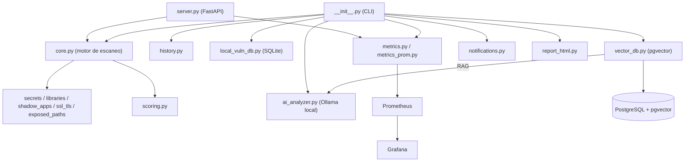
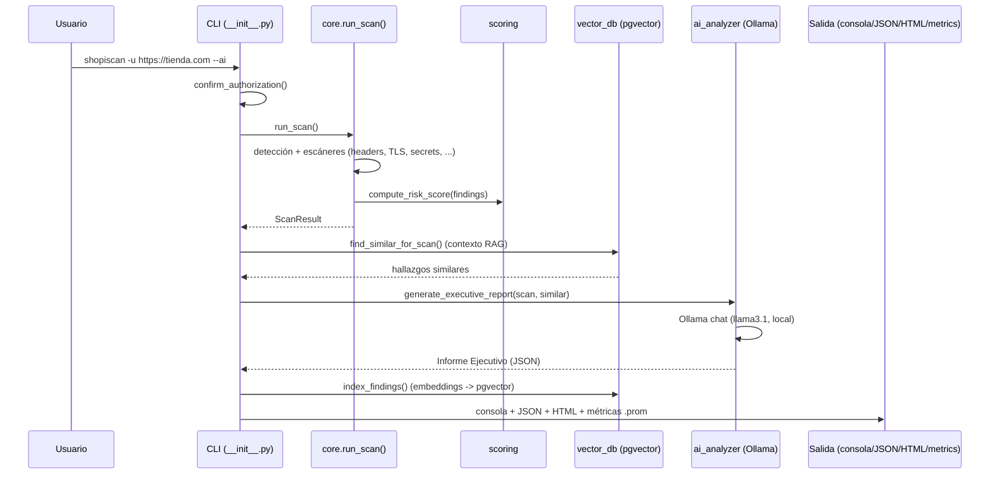

# Arquitectura de ShopiScan (v3)

## 1. Visión general

ShopiScan sigue una arquitectura en capas con un principio de diseño
transversal: **todo lo externo es opcional y degrada con elegancia**. El
escaneo técnico funciona de forma completamente autónoma (sin más red que
el propio objetivo) aunque falten Ollama, PostgreSQL, Prometheus o
cualquier otra pieza.

1. **Capa de recolección** (`core.py` y los `*_scanner.py`): obtiene datos
   públicos del objetivo (HTML, headers, cookies, endpoints, scripts,
   certificado TLS, rutas sensibles) sin ninguna acción ofensiva/activa.
2. **Capa de puntuación** (`scoring.py`): convierte los hallazgos en un
   score de riesgo 0-100 transparente y explicable.
3. **Capa de razonamiento con IA** (`ai_analyzer.py`): opcional; envía el
   JSON de hallazgos a un modelo **local de Ollama** y devuelve un Informe
   Ejecutivo de Riesgo. Sin API keys ni servicios externos.
4. **Capa de persistencia/inteligencia** (`history.py`, `local_vuln_db.py`,
   `vector_db.py`): histórico por tienda, base de datos local incremental
   (SQLite) y búsqueda semántica (PostgreSQL + pgvector) para contexto RAG.
5. **Capa de observabilidad/notificación** (`metrics.py`,
   `metrics_prom.py`, `notifications.py`): métricas Prometheus y alertas
   Slack/email.
6. **Capa de presentación/entrada** (`utils.py`, `report_html.py`,
   `__init__.py` para la CLI, `server.py` para el modo HTTP).

## 2. Diagrama de componentes

## 3. Flujo de datos de un escaneo (CLI con --ai)

## 4. Decisiones de diseño clave

- **IA local por defecto (Ollama).** Se eligió frente a una API en la nube
  por privacidad (los datos de tiendas de terceros no salen de la máquina),
  coste (gratis) y ausencia de límites de cuota. `ai_analyzer.get_embedding()`
  reutiliza Ollama también para los embeddings de pgvector.
- **Degradado en cascada.** Cada dependencia externa (Ollama, PostgreSQL,
  Prometheus, dotenv, notificaciones) se importa de forma perezosa y su
  ausencia produce un aviso, nunca una excepción que tumbe el escaneo.
- **Dos vías de métricas.** `metrics.py` (textfile collector) para la CLI
  puntual/batch; `metrics_prom.py` (prometheus_client + endpoint HTTP)
  para el servidor de larga vida. Misma semántica, distinto transporte.
- **Bug corregido en la resolución de la raíz del dominio** (`_site_root`):
  las comprobaciones de rutas conocidas (`/sitemap.xml`, `/products.json`,
  `/.env`...) se hacen siempre contra `scheme://netloc`, no concatenando
  sobre una URL con subpath/query, lo que antes causaba falsos positivos
  silenciosos al escanear una URL profunda.
- **Anti-soft-404.** `exposed_paths_scanner` sondea primero una ruta
  aleatoria inexistente; si el sitio responde 200 a todo, se omiten las
  comprobaciones de rutas sensibles para no generar falsos positivos.

## 5. Stack de despliegue (deploy/)

`docker compose` levanta cinco servicios que reflejan las directrices del
proyecto: **PostgreSQL+pgvector** (búsquedas vectorizadas), **Ollama**
(IA local, con descarga automática de modelos), el **servidor ShopiScan**
(FastAPI, expone `/metrics`), **Prometheus** (scrapea las métricas) y
**Grafana** (dashboards, con datasources Prometheus + Postgres y un
dashboard ya provisionados).
